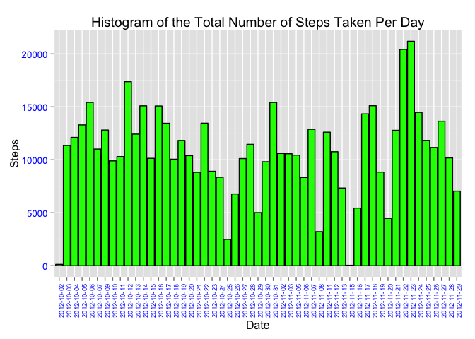
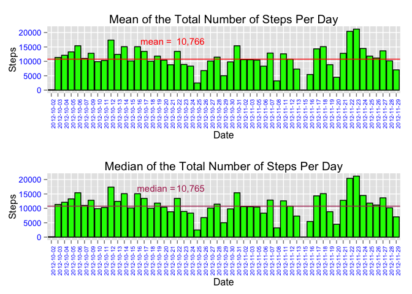
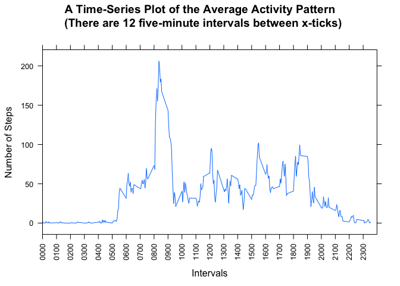
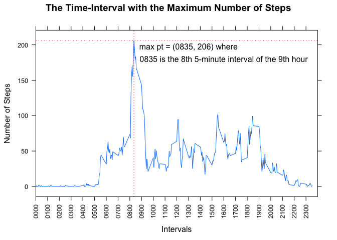

# Reproducible Research: Peer Assessment 1
Felix P. Muga II  


## Loading and preprocessing the data

The dataset were downloaded from the **COURSE WEBSITE** and named as `activity.csv` which is a comma-separated value file.

The dataset has 17,568 observations with 3 variables. These variables are:

* **steps** : Number of steps taken in a 5-minute interval.  *Missing values* are coded as `NA`.

* **date** :  The `date` on which the measurement was taken in `YYYY-MM-DD` format.  
There are 61 unique `dates` in the dataset which starts in `2012-10-01` and ends in `2012-11-30`.

* **interval** : `Identifier` for the 5-minute interval in which measurement was taken.  
Each `identifier` shall be expressed in `HHMM` format where `HH` is one of  $0,1,\ldots,23$ and `MM` is one of $0, 5,\ldots, 55$.   
The dataset has 288 unique 5-minute interval `identifiers` in a day.  
The interval identifier `0000` is the 1st 5-minute interval of the first hour,   
The interval identifier `0005` is the 2nd 5-minute interval of the first hour,  
$\vdots$   
The interval identifier `0075` is the 12th or the last 5-minute interval of the first hour,   
$\vdots$   
The interval identifier `2300` is the 1st 5-minute interval of the 24th hour,  
The interval identifier `2305` is the 2nd 5-minute interval of the 24th hour,  
$\vdots$   
The interval identifier `2375` is the 12th or the last 5-minute interval of the 24th hour.  

Thus, the total number of observations in the dataset is $288 \times 61 = 17,568$.


```r
#       Loading the CSV file as a data.format
rawdf <- read.csv("activity.csv")
#       Transforming the interval column in HHMM format
rawdf <- transform(rawdf, interval = sprintf("%0004d", interval))
#       The dataset is processed where observations with missing values are removed.
df <- rawdf[complete.cases(rawdf),]
```

We shall be using the following libraries: **dplyr**, **ggplot2**, **lattice** and **stringr** in this report.
        

```r
library(dplyr)
```

```
## 
## Attaching package: 'dplyr'
## 
## The following object is masked from 'package:stats':
## 
##     filter
## 
## The following objects are masked from 'package:base':
## 
##     intersect, setdiff, setequal, union
```

```r
library(ggplot2)
library(lattice)
library(stringr)
library(gridExtra)
```

```
## Loading required package: grid
```

## 1. What is mean total number of steps taken per day?

####    1.1. We make a histogram of the total number of steps taken each day. Days with missing values are not included.


```r
##       R Script of the histogram
#       png(file = "figure/plot1-histogram.png",width=640,height=480) 
qplot(date, data = df, weight = steps, 
      xlab = "Date", ylab = "Steps", 
      main = "Histogram of the Total Number of Steps Taken Per Day") + 
      geom_histogram(colour = "black", fill = "green") + 
      theme(axis.text.x = element_text(angle = 90, colour="blue",size=7),
                axis.text.y = element_text(colour = "blue",size=10))
```

 

```r
#       dev.off()
```

####    1.2. We calculate and report the mean and median total number of steps taken per day.


```r
##      R Script of the mean and median of the total number of steps per day
numSteps <- summarise(group_by(df, date), total=sum(steps))
mean <- format(round(mean(numSteps$total)), big.mark = ",")
median <- format(round(median(numSteps$total)), big.mark = ",")
#       png(file = "figure/plot2-mean_median.png",width=480,height=640) 
q <- qplot(date, data = df, weight = steps,  
            xlab = "Date", ylab = "Steps")
q <- q + geom_histogram(colour = "black", fill = "green")
q <- q + theme(axis.text.x = element_text(angle = 90, colour="blue",size=7),
                axis.text.y = element_text(colour = "blue",size=10))
q1 <- q + geom_abline(intercept = mean(numSteps$total), 
                      slope = 0,
                      colour="red")
q1 <- q1 + ggtitle("Mean of the Total Number of Steps Per Day")
q1 <- q1 +  annotate("text", 
                     x = c(17,22), 
                     y = c(17000,17000), 
                     label = c("mean = ", mean), 
                     size = 4, 
                     colour = "red")
q2 <- q + geom_abline(intercept = median(numSteps$total), slope = 0,colour="maroon")
q2 <- q2 + ggtitle("Median of the Total Number of Steps Per Day")
q2 <- q2 + annotate("text", 
                    x = c(17,22), 
                    y = c(17000,17000), 
                    label = c("median = ", median), 
                    size = 4, colour = "maroon")
grid.arrange(q1,q2, nrow=2)
```

 

```r
#dev.off()
```

## 2. What is the average daily activity pattern?

####    2.1. We make a time series plot (i.e. type = "l") of the 5-minute interval (x-axis) and the average number of steps taken, averaged across all days (y-axis). 


```r
#       R Script for the time series plot of the average daily activity pattern
dailyPattern <- summarise(group_by(df, interval), averageSteps = mean(steps)) 
labels <- sprintf("%0004d",seq(0,2400,by=100))
#       png(file = "figure/plot3-time_series.png",width=640,height=480) 
xyplot(
  averageSteps ~ interval,
  data = dailyPattern,
  type = "l",
  main = "A Time-Series Plot of the Average Activity Pattern
  (There are 12 five-minute intervals between x-ticks)",
  xlab = "Intervals",
  ylab = "Number of Steps",
  scales = list(x=list(tick.number=25, labels = labels, rot = 90)),
  xlim = c(0,2399)
)
```

 

```r
#       dev.off()
```

####    2.2. We answer the question  "Which 5-minute interval, on average across all the days in the dataset, contains the maximum number of steps?"


```r
#       Find max
rowindex4Max <- dailyPattern[which.max(dailyPattern$averageSteps),]
maxindex <- as.character(rowindex4Max[1,1][[1]])
maxsteps <- as.numeric(rowindex4Max[1,2][[1]])
maxpt <- sprintf("max pt = (%s, %.0f) where",
                 maxindex,
                 maxsteps)
hr <-as.numeric(str_sub(maxindex,start=1,end=2))
min <- as.numeric(str_sub(maxindex,start=3,end=4))
maxint <- sprintf("%s is the %dth 5-minute interval of the %dth hour",
                 maxindex,min/5+1,hr+1)
labels <- sprintf("%0004d",seq(0,2400,by=100))
#       png(file = "figure/plot4-max.png",width=640,height=480)
p <- xyplot(
        averageSteps ~ interval,
        data = dailyPattern,
        panel = function(x, y) {
                panel.xyplot(x, y, type="l")
                panel.abline(v=as.numeric(maxindex), lty = "dotted", col = "red")
                panel.abline(h=maxsteps, lty = "dotted", col = "red")
                panel.text(1300, 198, labels = maxpt)
                panel.text(1600, 180, labels = maxint)},
        main = "The Time-Interval with the Maximum Number of Steps",
        xlab = "Intervals",
        ylab = "Number of Steps",
        scales = list(x=list(tick.number=25, labels = labels, rot = 90)),
        xlim = c(0,2399)
        )
p
```

 

```r
#       dev.off()
```


Hence, the 5-minute interval that contains the maximum number of steps is equal to 0835 which is the 8th 5-minute interval of the the 9th hour of the day.

## 3. Imputing missing values


```r
missingValues <- rawdf[is.na(rawdf$step),]
missingDays <- summarise(group_by(missingValues, date), missing = n())
```

####    3.1. We calculate and report the total number of missing values in the dataset.


```r
missingNumber = format(nrow(missingValues),big.mark=",")
missingNumber
```

```
## [1] "2,304"
```

```r
missingDays
```

```
## Source: local data frame [8 x 2]
## 
##         date missing
## 1 2012-10-01     288
## 2 2012-10-08     288
## 3 2012-11-01     288
## 4 2012-11-04     288
## 5 2012-11-09     288
## 6 2012-11-10     288
## 7 2012-11-14     288
## 8 2012-11-30     288
```
There are 2,304 missing values in the dataset which are uniformly distributed among the 8 days, since $288 \times 8 = 2,304$. 


####    3.2. We devise a strategy for filling in all of the missing values in the dataset. 
   
*       The number of 5-minute intervals in a day is 288.

*       Each of the 8 days mentioned above has 288 missing values.

*       We computed the average number of steps per interval for each of the 5-minute intervals of a day from the 1st 5-minute interval 0000 to the last 5-minute interval 2375.

*       Hence, we shall fill up the missing value of each of the 5-minute intervals of each of the 8 days metioned above by the computed mean or the computed average number of steps of each corresponding interval.


####     3.3. We create a new dataset that is equal to the original dataset but with the missing data filled in.


```r
#       R code to create a new dataset equal to the original with missing data supplied.
#       subset with complete data
lower <- rawdf[!is.na(rawdf$steps),]
#       subset with incomplete data due missing steps
upper <- rawdf[is.na(rawdf$steps),]
#       incomplete data is replaced by mean of number of steps 
upper <- data.frame(dailyPattern[match(upper$interval, dailyPattern$interval),2],select(upper, -steps))
#       change the name of the first column to 'steps'     
names(upper)[1] <- 'steps'
#       rowbinding the two data frames 'upper' and 'lower'
newdf <- arrange(rbind(upper,lower), date, interval)
```

####     3.4. We make a histogram of the total number of steps taken each day.

See `figure/plot4-new_histogram.png'.

```r
##       R Script of the histogram      
#       png(file = "figure/plot3-new_histogram.png",width=640,height=480) 
qplot(date, data = newdf, weight = steps, 
      xlab = "Date", ylab = "Steps", 
      main = "Histogram of the Total Number of Steps Taken Per Day") + 
      geom_histogram(colour = "black", fill = "green") + 
      theme(axis.text.x = element_text(angle = 90, colour="blue",size=7),
                axis.text.y = element_text(colour = "blue",size=10))
```

 

```r
#       dev.off()
```

#####   3.4.1. We calculate and report the mean and median total number of steps taken per day. 

```r
#  R Script of the mean and median of the total number of steps per day
numSteps2 <- summarise(group_by(newdf, date), total=sum(steps))
mean2 <- format(round(mean(numSteps2$total)), big.mark = ",")
median2 <- format(round(median(numSteps2$total)), big.mark = ",")
```
The mean of the total number of steps per day if we impute the missing values with the computed mean of the corresponding 5-minute interval is equal 10,766. 

The median if we impute the missing values with the computed mean of the corresponding 5-minute interval is equal to 10,766.

#####   3.4.2. We answer the question "do these values differ from the estimates from the first part of the assignment?". 

Comparison | original dataset | modified dataset              
-----------|------------------|---------------------          
mean       |     10,766     |  10,766                                                                          
median     |   10,765     |  10,766                    

The difference in the computation of the mean between the original  and modified datasets is zero.

However, the difference with respect to the median between the original and the modified datasets is 
0.0001104207.

If we use the median instead of the mean in filling up the missing values,
the difference between the computed medians could be zero. However,
the difference between the computed means may not be zero.

#####   3.4.3. What is the impact of imputing missing data on the estimates of the total daily number of steps?

If the values that are used to replaced the missing data are meaningless or invalid from the "true" values which are missing, then these "illegal" values may cause problems in the statistical analyses.

## 4. Are there differences in activity patterns between weekdays and weekends?

####    4.1.    We create a new factor variable in the dataset with two levels – “weekday” and “weekend” indicating whether a given date is a weekday or weekend day.


```r
weekDays <- data.frame(weekday = c("Sunday",
                                   "Monday",
                                   "Tuesday",
                                   "Wednesday",
                                   "Thursday",
                                   "Friday",
                                   "Saturday"), 
                       weeklevel = c("weekend",
                                     "weekday",
                                     "weekday",
                                     "weekday",
                                     "weekday",
                                     "weekday",
                                     "weekend"))
levels <- weekDays[match(weekdays(as.POSIXct(rawdf$date)),weekDays$weekday),2]
rawdf2 <- data.frame(rawdf, weeklevel = levels)
rawdf2[c(1:3, 1720:1722),]
```

```
##      steps       date interval weeklevel
## 1       NA 2012-10-01     0000   weekday
## 2       NA 2012-10-01     0005   weekday
## 3       NA 2012-10-01     0010   weekday
## 1720     0 2012-10-06     2315   weekend
## 1721     0 2012-10-06     2320   weekend
## 1722     0 2012-10-06     2325   weekend
```

####    4.2.    We make a panel plot containing a time series plot (i.e. type = "l" ) of the 5-minute interval (x-axis) and the average number of steps taken, averaged across all weekday days or weekend days (y-axis). 

See `figure/plot5-panel_plot.png`

```r
#       The dataset is processed where observations with missing values are removed.
df2 <- rawdf2[complete.cases(rawdf2),]
dailyPattern2 <- summarise(group_by(df2, interval, weeklevel), averageSteps = mean(steps)) 
labels <- sprintf("%0004d",seq(0,2400,by=100))
#       png(file = "figure/plot4-panel_plot.png",width=540,height=640) 
xyplot(averageSteps ~ interval| levels(dailyPattern2$weeklevel), 
       data = dailyPattern2,
       type = "l",
       xlab = "Interval",
       ylab = "Average Number of Steps",
       scales = list(x=list(tick.number=25, labels = labels, rot = 90)),
       xlim = c(0,2399),
       layout=c(1,2))
```

 

```r
#       dev.off()
```
